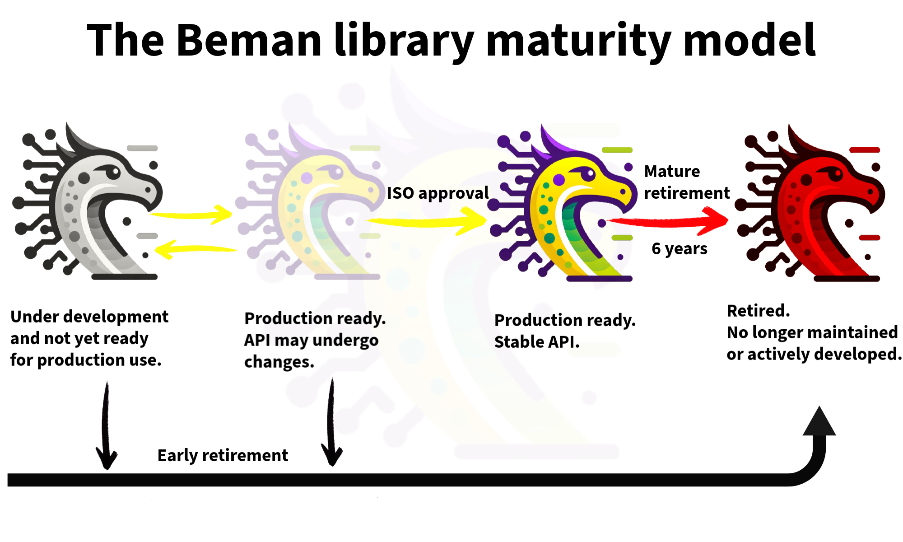

<!--
SPDX-License-Identifier: Apache-2.0 WITH LLVM-exception
-->

# The Beman Library Maturity Model

The Beman maturity model helps developers quickly assess the production readiness of Beman libraries by classifying them based on development phase and interface stability.

### Under development and not yet ready for production use.
 These libraries may deviate from the Beman Standard due to incompleteness, lack of testing, inconsistencies with the specification, or other non-conformances. They are not recommended for production usage.

### Production ready. API may undergo changes.
 These Beman-compliant libraries are production-ready, fully implementing the target paper with complete testing and documentation. Users should be aware that future API changes are possible and that standardization is not guaranteed.

### Production ready. Stable API.
 These production-ready libraries offer stable, standardized APIs.  They are part of the C++ Standard and can be used as a polyfill for compilers lacking native support. Note that these libraries will be retired after two standardization cycles (6 years).

### Retired. No longer maintained or actively developed.
 These libraries are not recommended for production use. They were [Production ready. Stable API.](./BEMAN_LIBRAY_MATURITY_MODEL.md#production-ready-stable-api) at some point, but are no longer developed or maintained, being superseded by native compiler implementations.

### Dropped. Never completed.
 These libraries should not be used for production. They were not completed because they were not accepted into the the C++ Standard.
